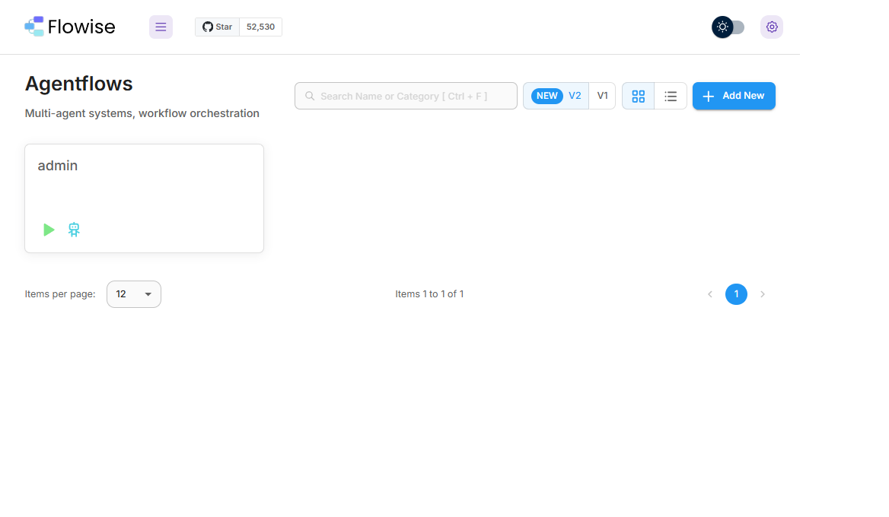
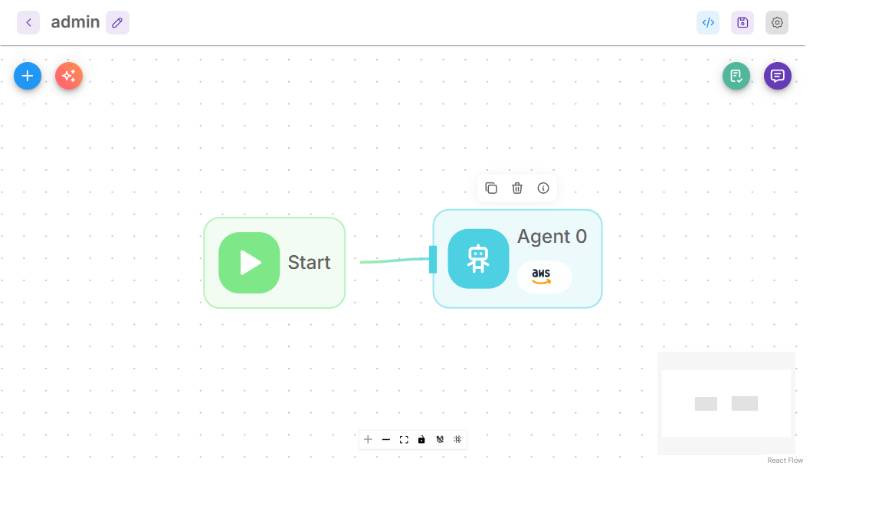
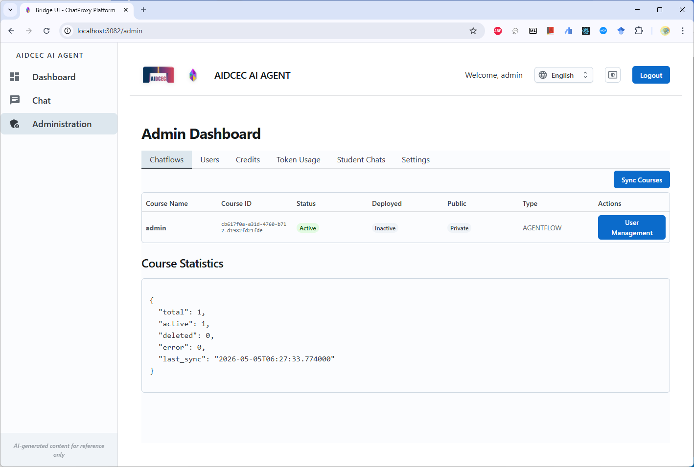
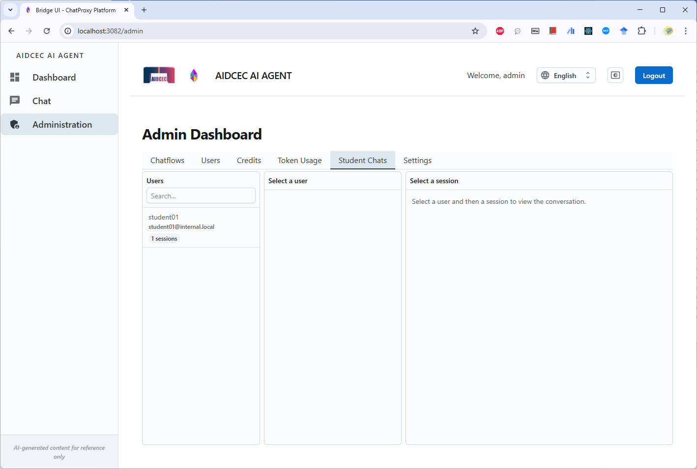
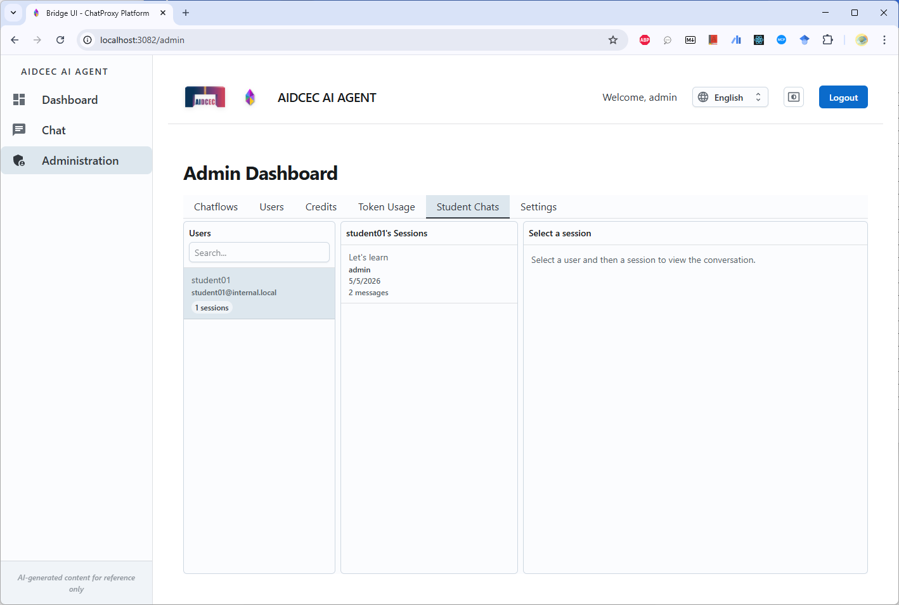
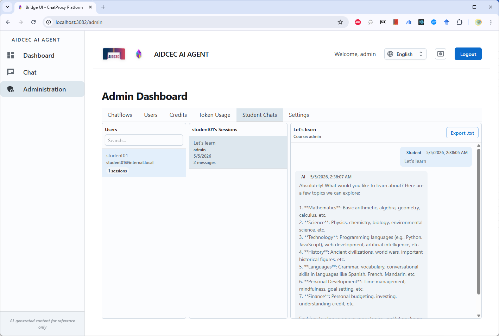

# 教師與管理者日常操作指南

本文件是從完整的 Windows Docker Desktop 工作站使用指南中，整理出較偏向「日常操作、帳號管理、課前準備、容量理解與維運」的內容，重點放在原文件第 7 節以後的主題。

---

## 1. 教師與管理者的日常使用方式

### 1.1 教師平常會接觸哪些部分

對大多數教師來說，日常操作通常包含：

- 使用 Bridge 前台測試學生看到的聊天體驗
- 使用 Flowise 管理聊天流程或教學用 chatflow
- 與管理者合作建立學生帳號
- 確認學生額度是否足夠
- 課前確認系統健康狀態

### 1.2 教師或管理者如何在 Flowise 查看 chatflow

若教師或管理者需要確認教學用 AI 流程是否存在、是否能進一步編輯，可在 Flowise 管理介面依照以下方式查看：

1. 進入 Flowise 管理介面。
2. 在 `Agentflows` 頁面確認目前可用的流程清單。
3. 點開指定流程後，可進入畫布檢視該 chatflow 的節點與連線設計。

畫面 1: 在 `Agentflows` 頁面查看目前可用的流程。



畫面 2: 進入流程畫布，查看 chatflow 的節點與流程連線。



### 1.3 管理者平常會接觸哪些部分

管理者或校內 IT 支援通常會負責：

- 啟動或重啟工作站上的整套服務
- 建立與維護帳號
- 分配教師與學生額度
- 執行更新
- 故障時執行診斷

### 1.4 管理者如何查看學生 chatflow 對話紀錄

若管理者需要查看學生實際使用某個 chatflow 的對話內容，可在 Bridge 管理後台依照以下路徑操作：

1. 先登入 Bridge，並進入左側的 `Administration`。
2. 在管理頁面中切換到 `Student Chats` 分頁。
3. 在左欄選取要查看的學生帳號。
4. 在中間欄位選取該學生的某一個對話 session。
5. 右欄就會顯示該次學生對話內容，管理者也可以使用 `Export .txt` 匯出。

步驟 1: 進入管理後台主頁。



步驟 2: 切換到 `Student Chats` 分頁。



步驟 3: 選取要查看的學生帳號。



步驟 4: 開啟學生的對話 session，查看 chatflow 對話內容。



### 1.5 學生的使用路徑

學生一般不需要接觸 Flowise 或後台服務，只需要：

1. 進入 Bridge 前台。
2. 使用學校提供的帳號登入。
3. 選擇可用的聊天流程或對話功能。
4. 開始提問。

這種前後台分離的做法，能降低學生直接接觸系統設定的風險。

---

## 2. 帳號、角色與額度的概念

依目前專案結構，可將角色理解為三類：

- 管理者：擁有最高管理權限
- 教師或督導角色：可協助管理學生、查看資料或分配資源
- 學生或一般使用者：主要進行對話與學習活動

額度系統的重點在於：

- 系統可記錄使用者剩餘額度
- 在送出 AI 請求前先檢查額度
- 請求完成後可扣除相應資源
- 管理者可調整教師與學生的配額

對教學現場而言，這代表學校可以：

- 控制每位學生的可用資源
- 避免少數帳號過度消耗 AI 用量
- 依課程需要設定不同班級或角色的使用政策

---

## 3. 建議的課前操作流程

若此平台要用於課堂前準備，建議教師或管理者依序檢查：

1. Docker Desktop 已啟動。
2. `setup.ps1` 建立的服務仍在執行。
3. `http://localhost:3082` 可正常開啟。
4. 至少用一組教師帳號完成登入測試。
5. 至少以一組學生帳號完成聊天測試。
6. 確認學生額度尚未耗盡。
7. 若本機還需對外提供服務，確認 Windows 防火牆與校內網路路由已設定完成。

如果只是本機測試，`localhost` 即可；如果要讓同一個教室或校內其他電腦連線，則還需要處理：

- 工作站的固定 IP 或 DNS 名稱
- 防火牆放行
- 反向代理或 TLS 憑證
- 校內網段存取規則

這部分已超出單純本機啟動範圍，通常需要 IT 支援協助。

---

## 4. 當目標是約 100 位學生同時使用時，如何理解 Windows 工作站部署

這是最需要先說清楚的一點。

目前專案文件已完整描述 Windows Docker Desktop 的部署流程，但沒有提供「單一 Windows 工作站已正式驗證可穩定承載約 100 位學生同時在線」的基準測試結果。因此，在規劃時應把以下兩件事分開看：

### 4.1 Windows 工作站模式

適合：

- 前期試行
- 小規模班級
- 教學展示
- 課程開發與驗證

優勢：

- 快速建置
- 維運簡單
- 成本低

風險：

- 單點故障
- 當多位學生同時送出請求時，工作站資源容易成為瓶頸
- 若外部 AI 模型回應速度波動，整體體驗會一起受影響

### 4.2 約 100 位學生同時在線的規劃建議

若目標是「穩定服務約 100 位學生同時使用」，比較務實的做法是：

1. 先用 Windows 工作站完成功能驗證與教師流程演練。
2. 針對預計使用的 chatflow 做壓力測試。
3. 若要提供正式課堂或跨班大量使用，優先評估 AWS 部署。

AWS 架構的優點包括：

- 可用負載平衡與自動擴充
- 服務不是綁在單一教室電腦上
- 資料庫與監控能力較完整
- 對跨班級、多時段或大量同時連線更穩定

因此，本文件建議的定位是：

- Windows Docker Desktop 工作站：適合部署、測試、示範、教學準備
- AWS：較適合要穩定承接較高併發量的正式服務

如果學校堅持從 Windows 工作站開始提供約 100 人服務，建議至少先完成以下條件：

- 使用較高規格硬體
- 先做實際課堂 chatflow 壓力測試
- 設定明確的備援與重啟流程
- 課堂期間安排現場技術支援

---

## 5. 更新、修補與日常維護

### 5.1 更新系統

若 repo 已有新版本，可在根目錄執行：

```powershell
.\patch.ps1
```

常見模式：

```powershell
.\patch.ps1 -Mode status
.\patch.ps1 -Mode full
.\patch.ps1 -Service auth-service
```

適用情境：

- `-Mode status`：先查看是否有更新
- `-Mode full`：需要完整重建時使用
- `-Service`：只修補單一服務時使用

### 5.2 日常診斷

若教師回報「登入失敗」、「畫面卡住」或「聊天沒有反應」，第一步通常不是重裝，而是先做診斷：

```powershell
.\diagnose.ps1 -Quick
.\diagnose.ps1 -Login
```

這能幫助管理者分辨問題是在：

- Docker 未啟動
- 某個服務未啟動
- 連接埠衝突
- JWT 設定不同步
- 登入流程異常

---

## 6. 常見問題與注意事項

### 6.1 連接埠 8000 被其他程式占用

Bridge 前台會透過本機 `8000` 連到 Flowise Proxy。若 `8000` 被其他程式占用，例如 SSH tunnel，可能造成：

- 登入看似成功，但聊天或管理功能失敗
- 前台呼叫到錯誤的服務

遇到這種情況，應先檢查是哪個程序占用了 8000。

### 6.2 重設部署後，資料庫憑證與新設定不一致

若曾做過重設或重建，但 Docker volumes 仍保留舊資料，可能出現：

- MongoDB 或 PostgreSQL 使用舊密碼
- 新產生的 `.env` 與舊資料庫狀態不一致
- 服務啟動後出現驗證錯誤

也就是說，重設不只要清掉設定檔，還要注意資料卷是否沿用舊狀態。

### 6.3 JWT secrets 必須一致

Auth Service、Accounting Service 與 Flowise Proxy 之間需要共享一致的 JWT 驗證設定。若其中一個服務使用不同 secret，常見結果是：

- 使用者可以登入，但聊天請求被拒絕
- 額度檢查失敗
- 系統看似正常，實際上跨服務驗證失敗

### 6.4 本機郵件是測試用途

本機部署下會使用 MailHog 做測試郵件，不代表正式對外郵件服務。這表示：

- 本機部署適合測試流程
- 若要正式對外寄送郵件，仍需規劃正式 SMTP 或雲端郵件服務

---

## 7. 建議的角色分工

若學校要把這套系統納入教學流程，建議分工如下：

- 教師：設計課程使用方式、測試 chatflow、安排學生帳號需求
- 管理者：維護帳號、權限與額度策略
- IT 支援：維護 Docker 工作站、處理防火牆、網路與對外服務設定

這樣可避免讓教師承擔過多系統維運工作。

---

## 8. 適合分享給教師的簡短結論

若只需要一句話向教師說明，可以這樣描述：

> 這套系統是把 Flowise 的 AI 教學流程，加上登入驗證、權限管理與學生額度控制後，包裝成一個較適合校園使用的教學平台；在初期可先用 Windows Docker Desktop 工作站快速部署，但若要穩定支援約 100 位學生同時使用，應盡早進行壓力測試並評估 AWS 等較具擴充性的部署方式。